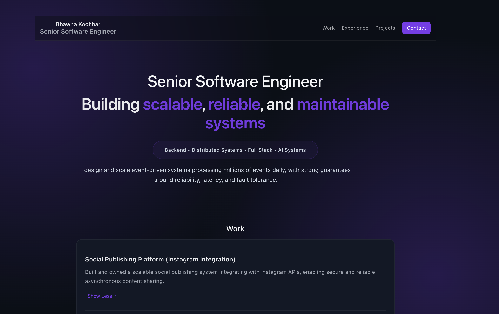
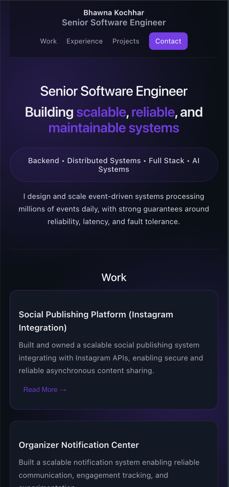
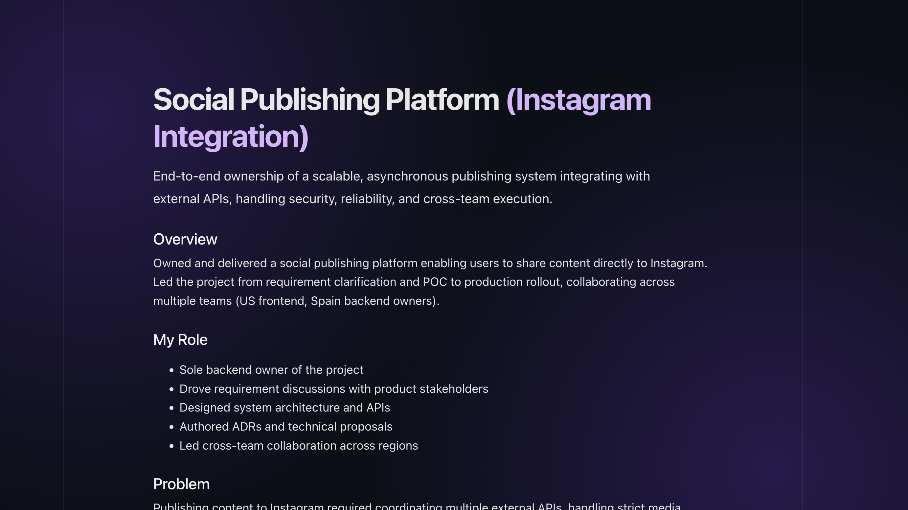

# Social Publishing Platform

A scalable UI for scheduling and managing social media posts with Instagram-style integration.

## Tech Stack

- React
- Vite
- CSS

## Features

- Responsive UI
- Case study driven design
- Modular component structure

## Live Demo

https://bk-ml.github.io/

## Screenshots

### Desktop View

### Mobile View

### Case Study

